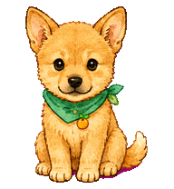
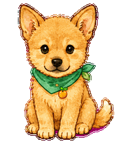
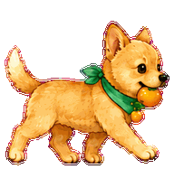

# 🍊 Meet Hondi!

[한국어](README.md) · [English](README.en.md) · [日本語](README.ja.md) · [简体中文](README.zh-CN.md)

**A tangerine to carry, a little nap to take. Meet the Jeju dog mascot of Omeong Gameong.**



Hondi is the mascot of **Omeong Gameong**, a travel app for exploring Jeju Island with your pet. With a round face, a slightly darker muzzle, and a tangerine held snugly in its mouth, Hondi is easy to spot.

Now you can keep a little Hondi on your screen, too. Leave Hondi alone for a moment and those eyes get sleepy. Move Hondi across the screen and the little tangerine walk begins. This repository has everything you need to install Hondi as a custom Codex pet.

**[🐾 Visit Hondi at Omeong Gameong →](https://omeong-gameong-web.vercel.app)**

## 🐾 A little Jeju daydream

Sea breezes, unfamiliar paths, and your favorite four-legged travel companion. If Jeju is on your mind, come say hello to **Omeong Gameong**, a travel app for visiting the island with your pet.

Enjoy having Hondi around? Take a peek at the place this little mascot calls home. 🍊

**[Explore Omeong Gameong on the web →](https://omeong-gameong-web.vercel.app)**

## 🍊 A day with Hondi

| When… | Hondi… |
|---|---|
| Things are quiet | Settles down for a sleepy little nod |
| You drag left or right | Takes little steps, tangerine in tow |
| It is time to say hello | Lifts a paw to wave |
| Waiting for you | Holds one front paw up patiently |
| Focusing | Sits with tiny eye and paw movements |
| Taking a closer look | Leans over and tilts its head |
| Looking around | Turns its gaze in sixteen directions |

| Just a tiny nap 💤 | Can't forget the tangerine 🍊 |
|---|---|
|  |  |

## 🏡 One-command install

Requires a Codex desktop app with custom pet v2 support.

**macOS / Linux shell**

```sh
curl -fsSL https://raw.githubusercontent.com/qkrwlgus89/hondi-codex-pet/main/install.sh | sh
```

**Windows PowerShell**

```powershell
& ([scriptblock]::Create((Invoke-WebRequest -UseBasicParsing https://raw.githubusercontent.com/qkrwlgus89/hondi-codex-pet/main/install.ps1).Content))
```

Then open **Settings → Pets → Refresh → 혼디 (Hondi)**. Restart the app if needed. Installation registers the files; select the pet in the app.

<details>
<summary>Installation details and removal</summary>

Installs to `~/.codex/pets/hondi`, or `$CODEX_HOME/pets/hondi` when configured. No Git, Python, Node.js, or administrator access is required. The shell installer needs curl and shasum/sha256sum. The original image is SHA-256 checked before installation. Identical installs are skipped; previous versions are preserved under `pet-backups` in your Codex home.

From a downloaded repository: `sh install.sh --from .` or `./install.ps1 -SourceDir .`. Review [install.sh](install.sh) or [install.ps1](install.ps1). To uninstall, select another pet and delete only the installed `hondi` directory.

The IDE extension does not display pets. Linux file installation does not guarantee client support. This v2 atlas is not the v1 web-upload format. See [official pet documentation](https://learn.chatgpt.com/docs/pets).

</details>

<details>
<summary>Sprite specifications and validation</summary>

## Repository contents

```text
.
├── README.md
├── README.en.md
├── README.ja.md
├── README.zh-CN.md
├── LICENSE.md
├── CHANGELOG.md
├── install.sh
├── install.ps1
├── pet-metadata.json
├── assets/
│   ├── hondi-spritesheet-v2.png
│   ├── hondi-contact-sheet.png
│   ├── previews/
│   └── stills/
└── docs/
    ├── SPRITE_SPEC.md
    ├── validation.json
    └── quality-report.json
```

## Sprite specification

| Item | Value |
|---|---|
| Version | ChatGPT Pet Sprite v2 |
| Format | Transparent PNG |
| Atlas size | 1536 × 2288 px |
| Grid | 8 columns × 11 rows |
| Cell size | 192 × 208 px |
| Required frames | 73 |
| Standard states | 9 |
| Look directions | 16 |
| SHA-256 | `8b2de2ac6ef0e65a03557fb95b2c25ba4c2b8b04747e55f8827241367cf62ace` |

See [SPRITE_SPEC.md](docs/SPRITE_SPEC.md) for row order and frame timing.

## Validation

- Passed v2 structural validation
- All 73 required frames are populated
- All 15 unused cells are fully transparent
- 34 px jump lift and 0 px landing-baseline error
- Maximum look-direction center drift: 4 px
- Passed the final Pets preflight

Detailed results are included in [validation.json](docs/validation.json) and [quality-report.json](docs/quality-report.json).

</details>

## License

No open-source license is currently granted for the character or image assets. Personal, non-commercial installation as a Codex pet and sharing the repository link are permitted. Asset redistribution, commercial use, and derivative works require permission from the rights holder. See [LICENSE.md](LICENSE.md).

## Credits

- Character: Hondi
- Project: Omeong Gameong
- Concept: Pet-friendly travel on Jeju Island
- Artwork workflow: AI-assisted generation and manual QA

Hondi is the mascot of Omeong Gameong. This custom pet is not an official OpenAI character or distribution.
